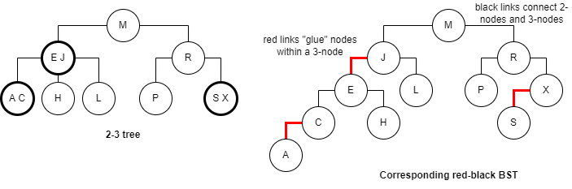

# Balanced Trees

## 2-3 Search Trees

**Allow 1 or 2 keys per node.**

- 2-node: one key, two children.
- 3-node: two keys, three children.

**Perfect Balance**

- Every path from root to null link has same length.

**Symmetric order**

- Inorder traversal yields keys in ascending order.

**Search**

- Compare search key against keys in a node.
- Find interval containing search key.
- Follow associated link (recursively).

**Insert into a 2-node at bottom**

- Search for key.
- Replace 2-node with 3-node.

**Insert into a 3-node at bottom**

- Add new key to a 3-node to create temporary 4-node.
- Move middle key in 4-node into a parent.
- Repeat up the tree, as necessary.
- If you reach the root, and it's a 4-node, split it into three 2-nodes.

**Global properties**

- **Invariants:** Maintains symmetric order and perfect balance.
- **Proof:** Each transformation maintains symmetric order and perfect balance.

**Performance**

- **Perfect balance:** Every path from root to null link has same length.
- **Tree height:**
    - The Worst case: `lg(N)` 
    - Best case: `log3 N = .631 lg(N)`
    - Between 12 and 20 for a million nodes.
    - Between 18 and 30 for a billion nodes.
- Guaranteed **logarithmic** performance for search and insert.

**Implementation**

- **Direct implementation is complicated, because:**
    - Maintaining multiple node types is cumbersome.
    - Need multiple compares to move down tree.
    - Need to move back up the tree to split 4-nodes.
    - Large number of cases for splitting.

## Red-Black Tree

**Left-leaning red-black BSTs**

- Represent 2-3 tree as a BST.
- Use "internal" left-leaning links as "glue" for 3-nodes.



**A BST such that**

- No node has two red links connected to it.
- Every path from root to null link has the same number of black links (perfect black balance).
- Red links lean left.

**Search implementation for red-black BSTs**

- **Observation:** Search is the same (but runs faster because of better balance) as for elementary BST.

```java
public Val get(Key key) {
    Node x = root;
    while (x != null) {
        int cmp = key.compareTo(x.key);
        if (cmp < 0) {
            x = x.left; 
        } else if (cmp > 0) {
            x = x.right;
        } else if (cmp == 0) {
            return x.val;
        }
    }
    return null;
}
```

- **Remark:** Most other ops (e.g., ceiling, selection) also identical.

**Red-black BST representation**

- Each node is pointed to be precisely one link (from its parent) => can encode color of links in nodes.


```java
private static final boolean RED = true;
private static final boolean BLACK = false;

private class Node {
    Key key;
    Value val;
    Node left, right;
    boolean color;  // color of parent link 
}

private boolean isRed(Node x) {
    if (x == null) {
        return false; // null links are black
    }
    return x.color == RED;
}
```

**Elementary red-black BST operations**

- **Left rotation:** Orient a (temporarily) right-leaning red-link to lean left.
- **Invariants:** Maintains symmetric order and perfect black balance.

```java
private Node rotateLeft(Node h) {
    Node x = h.right;
    h.right = x.left;
    x.left = h;
    x.color = h.colot;
    h.color = RED;
    return x;
}
```

- **Right rotation:** Orient a left-leaning red link to (temporarily) lean right.
- **Invariants:** Maintains symmetric order and perfect black balance.

```java
private Node rotateRight(Node h) {
    Node x = h.left;
    h.left = x.right;
    x.right = h;
    x.color = h.colot;
    h.color = RED;
    return x;
}
```

- **Color flip:** Recolor to split a (temporary) 4-node.
- **Invariants:** Maintains symmetric order and perfect black balance.

```java
private void filpColors(Node h) {
    h.color = RED;
    h.left.color = BLACK;
    h.right.color = BLACK
}
```

**Insertion in a LLRB tree**

- **Basic strategy:** Maintain 1-1 correspondence with 2-3 trees by applying elementary reb-black BST operations.
- **Case 1:** Insert into a 2-node at the bottom.
    - Do standard BST insert; color new link red.
    - If new red link is a right link, rotate left.
- **Case 2:** Insert into a 3-node at the bottom.
    - Do standard BST insert; color new link red.
    - Rotate to balance the 4-node (if needed).
    - Flip colors to pass red link up one level.
    - Rotate to make lean left (if needed).
    - **Repeat case 1 or case 2 up the tree (if needed).**
- **Same code handles all cases.**
    - Right child red, left child black: **rotate left**.
    - Left child, left-left grandchild red: **rotate right**.
    - Both children red: **flip colors**.

```java
private Node put(Node h, Key key, Value val) {
    if (h == null) {
        return new Node(key, val, RED);
    }
    int cmp = key.compareTo(h.key);
    if (cmp < 0) {
        h.left = put(h.left, key, val);
    } else if (cmp > 0) {
        h.right = put(h.right, key, val);
    } else {
        h.val = val;
    }

    if (isRed(h.right) && !isRed(h.left)) {
        h = rotateLeft(h); // lean left
    }
    if (isRed(h.left) && isRed(h.left.left)) {
        h = rotateRight(h); // balance 4-node
    }
    if (isRed(h.left) && isRed(h.right)) {
        flipColors(h); // split 4-node
    }
    return h;
}
```

**Balance in LLRB trees**

- **Proposition:** Height of tree is `<= 2log(N)` in the worst case.
- **Proof:**
    - Every path from root to null link has same number of black links.
    - Never two red links in a row.
- **Property:** Height of tree is `~ 1.00 lg(N)` in typical applications.


